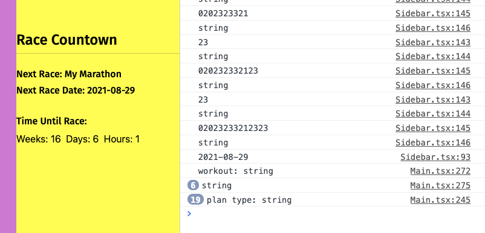

# Daily Progress

You are going to keep notes here on what you got accomplished and what you need to do for the next day. You will show this to your LA or instructor for the daily standups that we will have.

## 04/08/2021

I was able to start work on the back end. I was able to get the nodemon server initialized, models defined, framework for controllers create, etc.

I realized that getting all users and returning all attributes might not be a good way to handle what I want to do. I essentially want a list of all coaches so the user can authorize a coach. Getting all users would show everyone regardless of whether or not they're a coach and would also return a bunch of data that we wouldn't want all people to have. I had originally thought this would be an unauthenticated endpoint. Both dumb ideas. So I made it authenticated and then also am only returning id, email, firstname and lastname where coach = true. Much more secure way of doing this.

* all user controller endpoints finished
* tested with postman

What's Next?

* Start working on plan controller next.

## 04/13/2021

I didn't have the associations correct for my plan and workout tables. I spent a good amount of time tonight getting that working properly.

I also realized that the way I was associating users with coaches via the team table was not going to work as I need it to. I ended up creating an association between the user table and team table and will have the user own the team record if they are a coach. Had to redo the user controller so that if a user had the profile set to "coach" it would automatically create the appropriate record in the team table. In that table there will be a column that will store the IDs of runners that have added themselves to that team.

Did get the plan controller completed. Realized that the datatype I had for the date should have been DATEONLY for the plan date and the user birthdate so had to redo that work. 

Started on the workout controller. 

Completed

* DB associations
* user controller
* plan controller

What's Next?

* workout controller
* team controller

## 04/15/2021

Got associations to work to pull in the team if the user is a coach. This will then pull the team record for that user as well as I have access to the user's runners.

```text
User.findOne({
    where: {
        email: req.body.user.email
    },
    include: "team"
})
```

Figured out how to check to see if the coach coaches the runner they're looking up

```javascript
    if (req.user.team) {
        if (req.user.team.runners) {
            if (!req.user.team.runners.includes(parseInt(req.params.id))) {
                // Deny access if not a coach and the id doesn't match one of their runners
                return res.status(403).json({ message: "You are not this runner's coach." })
            } 
        } else if (req.user.team.runners === null) {
                // Deny access if not a coach has no runners
                return res.status(403).json({ message: "You are not this runner's coach." })
        }
    }
```

Completed

* DB associations
* user controller
* plan controller

What's Next?

* workout controller
* team controller

## 04/19/2021

I built out the react app for front-end with typescript support and started fleshing out the components I'd need along with installing dependencies like react-strap and bootstrap.

## 04/20/2021

Got finished with the login and signup pages for the application using [this example](https://www.positronx.io/build-react-login-sign-up-ui-template-with-bootstrap-4/). Had some challenges remembering how to do interfaces for variable types and using state. Also had some challenges figuring out how to do the onChange events to get the values from the inputs but finally figured that out.

## 04/22/2021

Laurine showed me a way to handle directing to the right page based on whether the user had authenticated using Router and RouteComponentProps along with withRouter. Got everything working so that you see the homepage if you're not authenticated. You can login from the navbar and then you will be shown the main page and sidebar. You can switch between login/signup. If you logout it will clear your cookie and display a message.

It feels like I'm finally getting the hang of interfaces and props and types and all of that typescript stuff. Even refactored my App component so that it was a class component as well.

[Using withRouter in a TypeScript React Component](https://www.dev-eth0.de/2019/09/10/using-withrouter-in-a-typescript-react-component/)

[React Router: Declarative Routing for React](https://reactrouter.com/web/api/Redirect)

## 04/27/2021

Was able to get the main page and sidebar layouts working with the use of [React Pro Sidebar](https://github.com/azouaoui-med/react-pro-sidebar). Also using [React Icons](https://react-icons.github.io/react-icons) in the sidebar. The sidebar allows for the use of SASS for styling variables so had to figure out how to get that to work:

[https://www.w3schools.com/react/react\_sass.asp](https://www.w3schools.com/react/react_sass.asp)



I'm using modals for the all of the screens for this application. Got those working today - here's some additional information for reference.









## 4/29/2021

Was able to get all of the create modals for workouts and plans added to the main/sidebar and get data into the backend database. Even added a nested modal for creation so that when you click a calendar day you are asked which type of entry you want to create.

Very productive evening tonight.

## 5/1/2021

**setItem\(\)**

Use the `setItem()` function to store an item in LocalStorage. This function takes a key as its first argument and a value as the second argument. **As mentioned earlier, both must be strings**. &lt;- Ran into this issue when trying to add the user id to local storage so I could use that to do lookups.

Epoch time is just a number and react big calendar accepts javascript data object. So you need to convert it into javascript date object new Date\(&lt;&gt;\) will do it. [https://stackoverflow.com/questions/49862998/react-bigcalendar-date-conversion/50847260](https://stackoverflow.com/questions/49862998/react-bigcalendar-date-conversion/50847260)

Had to update backend. I had an endpoint that would get all workouts/plans by userid but didn't have one that got a workout or plan by it's id. so had to create a new one and for consistency updated the PUT endpoint so that they're similar \(/plan/update/:id and /plan/get/:id\)

Got the view/edit modals all working for both plans and workouts.

Also got both types of events to show up on the calendar but used the eventPropGetter of Big Calendar to add the type of event to the CSS Classname so I could style them differently. This will work great.

## 5/2/2021

A frustrating day today. I spent the better part of the morning trying to figure out how to handle updating workouts and plans within the modals. I wanted to use the same forms from the modals for the creation but couldn't figure out whether the best way to do do it was to use state within the child or create state in main.tsx \(parent\) and then update it from the child. Ended up going that route but it took two or three attempts to finally get it all working.

Placeholder does not work with input fields that are set to date. That caused me a ton of problems and why I ended up going the route of storing the plan/workout data in the parent and updating it via a function from the child.

[https://stackoverflow.com/questions/18146350/how-do-i-simulate-placeholder-functionality-on-input-date-field](https://stackoverflow.com/questions/18146350/how-do-i-simulate-placeholder-functionality-on-input-date-field)

**2- Using** [**spread syntax**](https://developer.mozilla.org/en-US/docs/Web/JavaScript/Reference/Operators/Spread_operator):

```text
this.setState(prevState => ({
    jasper: {                   // object that we want to update
        ...prevState.jasper,    // keep all other key-value pairs
        name: 'something'       // update the value of specific key
    }
}))
```

**Note:** `Object.assign` and `Spread Operator` creates only [shallow copy](https://stackoverflow.com/questions/518000/is-javascript-a-pass-by-reference-or-pass-by-value-language), so if you have defined nested object or array of objects, you need a different approach.

Am running into issues getting the default units to act correctly on the modals for create plans and create workouts. Decided to give up on that for today.

Was able to get the goal countdown timer working fairly easily. It's really slick and I liked the approach I took. Decided to have the workout totals and goal calculations happen in Sidebar.TSX instead of main. It means another backend query but was a much cleaner way of doing it. The workout and plan queries I did in main populated an array of objects that is used for Big Calendar so i'd have had to make a bunch of modifications to get that to work.

Struggling with data from my database which should be numbers showing up as strings!?





## 5/4/2021

The HTML Input datetime-local type requires removing the Z from the YYYY-MM-DDTHH:MMZ format. Also found out that PostgreSQL/Sequelizer store timestamps with time zone but then always return UTC when you query. Needed to convert to local time by converting it to string, then removing GMT and adding UTC. Then we can generate a new local date with that convert it to ISO format and then remove the Z so it works with the input type.

```text
timestamp: new Date(new Date(workout.timestamp).toString().split('GMT')[0]+' UTC').toISOString().replace('Z', '').toString(), 
```

On the plans showing up on the prior day, Big Calendar will work with a simple date input but will assume that it's midnight UTC. I needed to add the local offset for the current Z back to this and use that value and then it worked. I had set the column in Postgres to date instead of timestamp with time zone. If I had done that then the fix above for the workouts would have worked for this as well.

I also had to deal with this with pushing the date to the event creation. Because when Calendar sends the start/end time those are in UTC. Since midnight would be 00:00:00, everything was showing up as 04:00:00. So instead of adding the timezone difference, I had to subtract it. Example of what big cal sends when you select a slot: Sat May 15 2021 00:00:00 GMT-0400 \(Eastern Daylight Time\) When you convert that to ISO though it gets converted to UTC.

```text
var tmpDate = new Date(plan.date);
tmpDate.setHours(tmpDate.getHours() + (new Date().getTimezoneOffset() / 60));
```

Finally figured out how to get the default units part working. The challenge here was that the HTML select input uses the value property to set the default. The onChange will update the value using a function if it changes. But if we set the value to the default units which is a state in the parent, updating it on change is very cumbersome. You'd have to write a function in the parent that changes the state and pass the function to the child and update it that way. What I ended up doing was creating a units state in the child. I am passing the user settings to the child from the parent. I then used componentDidUpdate to see if the props from the parent changed. If they did, I updated the state in the child which will re-render the HTML for the select input.

```text
componentDidUpdate(prevProps: CreatePlanModalProps, prevState: CreatePlanModalState) {
    if (prevProps.userSettings.defaultUnits !== this.props.userSettings.defaultUnits) {
        this.setState({ units: this.props.userSettings.defaultUnits });
    }
}

exitModal = () => {
    this.setState({ units: this.props.userSettings.defaultUnits });
    this.props.createPlanToggle();
}
```

I also needed a way to set the state in the child component back to the default when the user saved an entry with a different unit than the default and also if they changed it but then cancelled. So I did that with a function that changes the state back before it flips the toggle and also changes the state to the default units after it writes a new entry.

## 5/5/2021

Users were getting denied access if they weren't a coach. My checking in the server side was faulty. I was looking for an exact match but userID is an integer, paramsid is a string

{ "message": "IDs don't match.", "userid": 2, "paramsid": "2" }

```text
if (req.user.id === req.params.id) {
    const query = {
        where: {id: req.params.id}
    }
```

Spent a ton of time today working on endpoints and re-squashing time and date bugs due to the way HTML inputs work, how Sequelize returns datetime and how BigCalendar handles them. Finally got all of this working.

Also fixed a bug related to login \(user not found\) with Rob/Marco's help.

Refreshing calendar was fairly easy. Big Calendar will re-render when the events state changes. So I just needed to create a function that fetched all workouts and plans again and updated the events array state.

Was also able to get the +more working - it's a setting in Big Calendar. 


## 5/6/2021

Got sidebar updating automatically by changing how the workouts and plans are pulled. Prior, I had the sidebar component loading all plans and workouts but what I needed was when the plans and workouts reloaded in the parent, to have state/props updated in the child so it would refresh. So I changed this and pulled the workouts and plans and stored them in state in the parent and then passed them as props to Sidebar.

This helped with the refresh of stats/goals. It also caused one less backend query I guess. But then I had to redo all of my calculations for goals and totals. I was using state to do the addition but now since the workouts and plans were getting passed from the parent, I couldn't guarantee that the state in the child would be updated quickly enough. Had to rework everything to use local variables to do the calculations and then write those to state at the end.

I struggle a lot with how to handle the fact that state updates happen asynchronously.

## 5/8/2021

Lots of progress on the user profile portion of the app as well as the view as user capabilities.

User is able to edit their user settings from the database and do CRU operations. Also, pulling a list of coaches and allowing them to add coaches to their profile which modified the corresponding team in the teams table.

View As works by having a state in main.tsx which is passed to all children components which is set to the user id that the current logged in user is impersonating. By default, they are viewing as their own user id but coaches have the ability to move between user ids.

Restrictions in place for modifying, deleting or creating workouts as a coach for runners.

Ability to switch between views of users you coach.

## 5/6/2021

Styling complete.

Deployed to Heroku.

Starting on Strava. Going to use [https://github.com/UnbounDev/node-strava-v3](https://github.com/UnbounDev/node-strava-v3).

