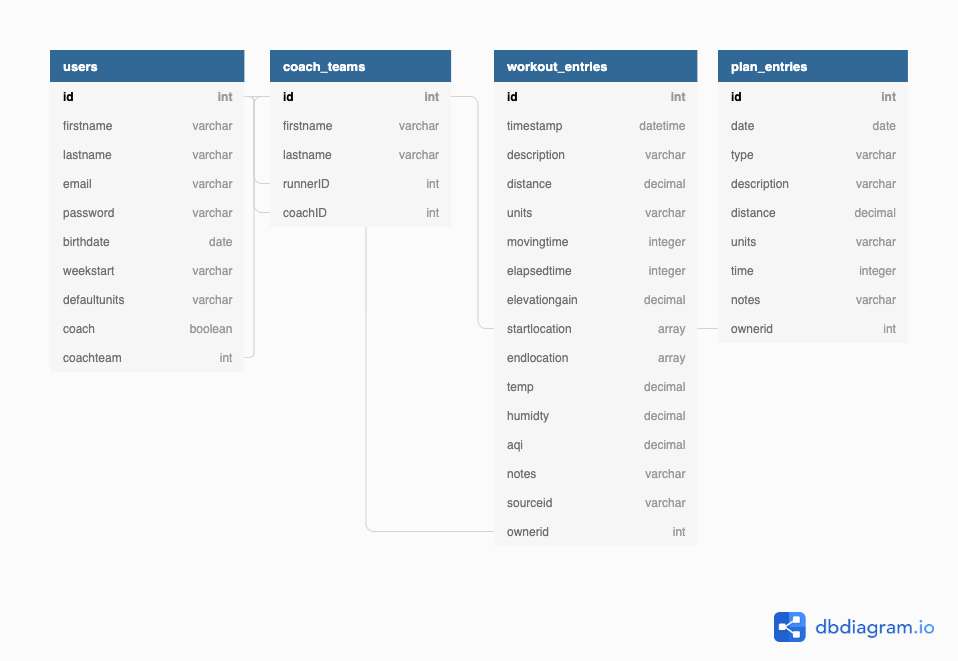

# Database Structure

RunJournal will use three PostgresSQL tables to store information for the application. User information including profile settings \(birthdate, start of week, default units, coach, etc.\) will be stored in the users table. Workout results either manually entered into the application or downloaded from Strava will be stored in the workout\_entries table. Training plan entries created by the user \(goals, workouts, etc.\) will be stored in the plan\_entries table.

**Table Name: users**

| **ID** | email | **password** | **firstname** | **lastname** | **birthdate** | **weekstart** | **defaultunits** | **coach** | **coachteam** |
| :--- | :--- | :--- | :--- | :--- | :--- | :--- | :--- | :--- | :--- |
| autocreated | string | string | string | string | date | string | string | boolean | integer |

**Table Name: coach\_teams**

| **ID** | **FirstName** | **LastName** | **runnerID** | **coachID** |
| :--- | :--- | :--- | :--- | :--- |
| autocreated | string | string | integer | integer |

**Table Name: workout\_entries**

| **ID** | **Description** | **Distance** | **Units** | **MovingTime** | **ElapsedTime** | **ElevationGain** | **StartLocation** | **EndLocation** | **Temp** | **Humidity** | **AQI** | **Notes** | **SourceID** | **ownerID** |
| :--- | :--- | :--- | :--- | :--- | :--- | :--- | :--- | :--- | :--- | :--- | :--- | :--- | :--- | :--- |
| autocreated | string | decimal | string | interval | interval | decimal | Array\[decimal\] | Array\[decimal\] | decimal | decimal | decimal | string | string | integer |

**Table Name: plan\_entries**

| **ID** | **Date** | **Type** | **Description** | **Distance** | **Units** | **Time** | **Notes** | **ownerID** |
| :--- | :--- | :--- | :--- | :--- | :--- | :--- | :--- | :--- |
| autocreated | date | string | string | decimal | string | interval | string | integer |

