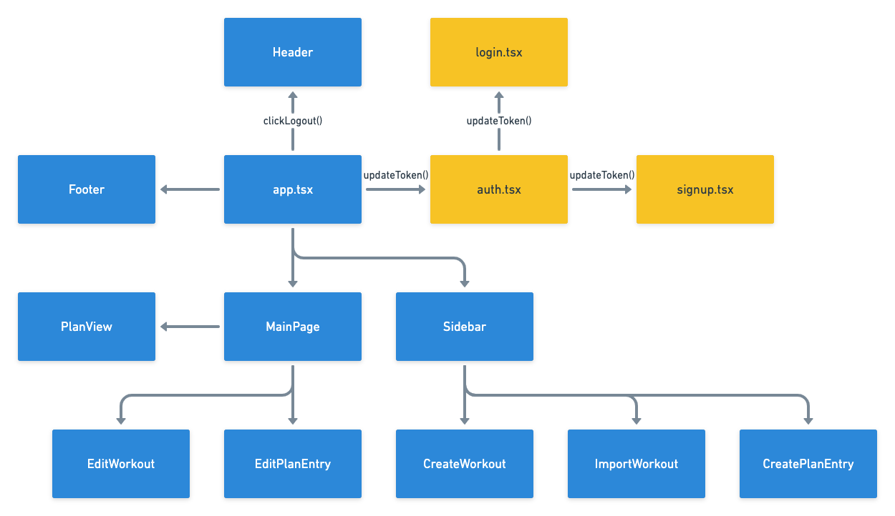

# Dataflow

RunJournal will appear in the browser as a single page application. Class components will be called to generate the application. Modal pages will pop up when editing, creating or importing a workout.

[Link to Dataflow Diagram](https://whimsical.com/runjournal-dataflow-WR6E3HM7p6FvfEwRpHe1dx)

